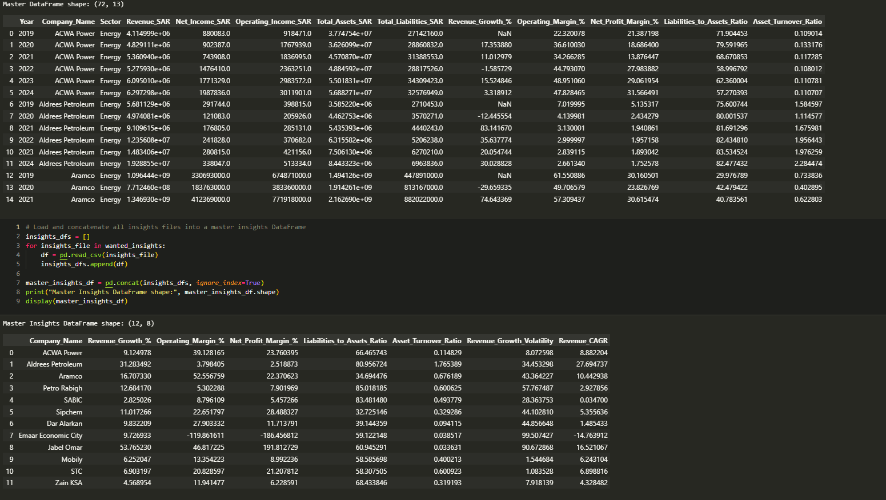
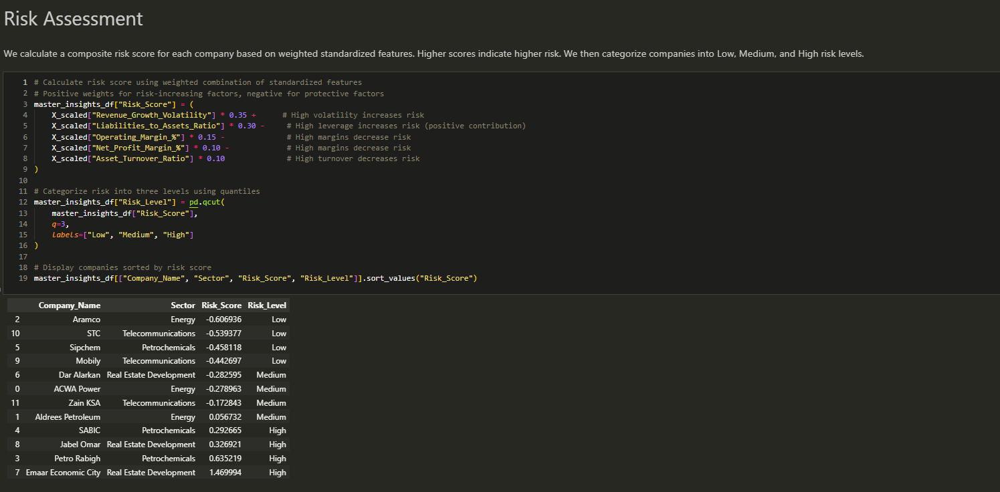

# Saudi Sectors Financial Performance & Risk Overview (2019–2024)

## Growth • Profitability • Efficiency • Risk Dynamics

### 📊 Project Overview
#### 🇬🇧 English

This project provides a comparative financial analysis of key Saudi sectors — Energy, Petrochemicals, Real Estate Development, and Telecommunications — focusing on how growth, profitability, efficiency, and risk interact across companies and sectors.

Rather than analyzing financial metrics in isolation, the dashboard adopts a risk-adjusted perspective, helping decision-makers understand not only who grows, but at what cost and level of stability.

The analysis is visualized through an interactive Power BI dashboard, designed for both desktop analysis and mobile executive viewing.

#### 🇸🇦 العربية

يقدم هذا المشروع تحليلًا ماليًا مقارنًا لأهم القطاعات في المملكة العربية السعودية — الطاقة، البتروكيماويات، التطوير العقاري، والاتصالات — مع التركيز على العلاقة بين النمو، الربحية، الكفاءة، والمخاطر.

بدل الاكتفاء بعرض المؤشرات المالية بشكل منفصل، يعتمد المشروع منظورًا قائمًا على الأداء المعدل بالمخاطر، مما يساعد صناع القرار على فهم من ينمو وبأي مستوى من الاستقرار والمخاطرة.

تم تنفيذ التحليل باستخدام لوحات معلومات تفاعلية في Power BI، مصممة للاستخدام على أجهزة الحاسب والجوال.

### 🎯 Project Objectives

##### Compare financial performance across major Saudi sectors

##### Analyze revenue growth trends over time

##### Evaluate profitability using operating and net profit margins

##### Assess operational efficiency via asset turnover

##### Incorporate volatility and leverage into a unified risk perspective

##### Identify companies with highest and lowest risk exposure

### 🧾 Data Scope & Coverage

##### Sectors:
1-Energy  
2-Petrochemicals 
3-Real Estate Development  
4-Telecommunications  

##### Companies:
1-Aramco  
2-ACWA Power  
3-Aldrees Petroleum  
4-SABIC  
5-Sipchem  
6-Petro Rabigh 
7-Emaar Economic City 
8-Jabal Omar 
9-Dar Alarkan 
10-STC 
11-Mobily 
12-Zain KSA 

##### Period:
2019 – 2024

##### Notes & Assumptions:

Financial data was manually collected and standardized from annual reports and trusted financial sources

Growth rates and ratios were normalized to ensure cross-company comparability

Forecasted growth indicators are directional and exploratory, not precise predictions

### 🧠 Methodology (High-Level)

##### Financial Ratios:
1-Revenue Growth % 
2-Operating Margin % 
3-Net Profit Margin % 
4-Asset Turnover Ratio 

##### Risk Components:

1-Volatility 

2-Leverage 

3-Profitability stability 

4-Risk Score: 
A composite, relative score used to rank companies within and across sectors
(Higher score ≠ bad company, but higher relative risk exposure)

### 📈 Dashboard Walkthrough
##### 🔹 Page 1 – Executive Overview

Sector-level KPIs

Growth, profitability, and efficiency snapshot

Highest and lowest risk companies

Revenue growth trends and directional forecasts

##### 🔹 Page 2 – Company-Level Analysis

Average revenue growth by company

Net profit margin comparison

Risk classification table

Asset turnover vs operating margin (efficiency vs profitability)

##### 🔹 Page 3 – Sector-Level Risk & Stability

Operating vs net profit margins by sector

Volatility comparison

Leverage comparison

Consolidated risk interpretation

### 📌 Key Business Insights
#### 🇬🇧 English

Revenue growth varies significantly across sectors, driven by cyclical exposure and capital intensity

The Energy sector combines high profitability with relatively controlled volatility

Real Estate Development exhibits elevated growth potential accompanied by higher risk dispersion

High growth does not necessarily translate into operational efficiency

Risk-adjusted performance favors companies with balanced leverage and stable operating margins

#### 🇸🇦 العربية

يظهر نمو الإيرادات تباينًا واضحًا بين القطاعات نتيجة لاختلاف الدورات الاقتصادية وكثافة رأس المال

يتميز قطاع الطاقة بربحية مرتفعة مع مستوى تقلبات يمكن التحكم به

قطاع التطوير العقاري يظهر فرص نمو أعلى ولكن مع تشتت أكبر في المخاطر

النمو المرتفع لا يعني بالضرورة كفاءة تشغيلية أعلى

الأداء الأفضل غالبًا ما يكون للشركات ذات المديونية المتوازنة وهوامش التشغيل المستقرة

### 📱 Mobile-Optimized Design

In addition to the desktop dashboard, a mobile-optimized layout was designed to ensure that key insights remain accessible for executives and decision-makers on the go.

The mobile version prioritizes:

Clear KPIs

Minimal visual clutter

Executive-level summaries

### 🛠 Tools & Technologies

Power BI – Data modeling, DAX, visualization

Financial Analysis – Ratio analysis, sector benchmarking

Data Preparation – Manual data standardization and validation

### 🚀 Conclusion & Next Steps

This project demonstrates how financial performance becomes more meaningful when viewed through a risk-adjusted lens rather than isolated metrics.

Potential Enhancements:

Integration of macroeconomic indicators

Scenario-based forecasting models

Time-weighted risk scoring

Expansion to additional sectors or regional benchmarks

### 👤 Author

#### Asem Haij
##### Data Analyst | Financial Analysis | Power BI
**GitHub:**  https://github.com/ProfASEM
