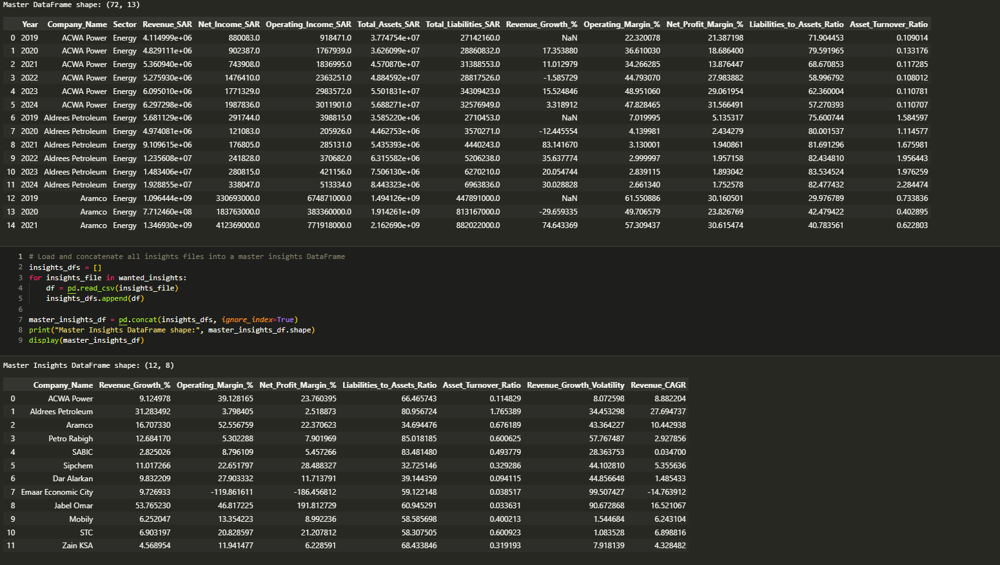
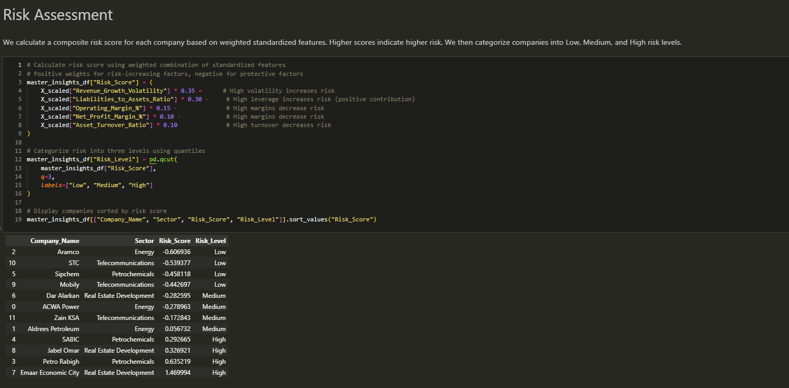

# Financial Saudi Market Analysis (2019–2024)

### 📊 Project Overview
#### 🇬🇧 English

This project develops a risk-adjusted sector benchmarking model for the Saudi financial market, designed to evaluate growth sustainability, earnings stability, and capital efficiency across sectors in a post-COVID environment.

Rather than focusing solely on descriptive metrics, the model integrates growth dynamics, volatility patterns, leverage exposure, and profitability stability to support strategic capital allocation and sector positioning decisions.

## Growth • Profitability • Efficiency • Risk Dynamics

#### 🇸🇦 العربية

يقدم هذا المشروع تحليلًا ماليًا مقارنًا لأهم القطاعات في المملكة العربية السعودية — الطاقة، البتروكيماويات، التطوير العقاري، والاتصالات — مع التركيز على العلاقة بين النمو، الربحية، الكفاءة، والمخاطر.

بدل الاكتفاء بعرض المؤشرات المالية بشكل منفصل، يعتمد المشروع منظورًا قائمًا على الأداء المعدل بالمخاطر، مما يساعد صناع القرار على فهم من ينمو وبأي مستوى من الاستقرار والمخاطرة.

تم تنفيذ التحليل باستخدام لوحات معلومات تفاعلية في Power BI، مصممة للاستخدام على أجهزة الحاسب والجوال.

### 🎯 Project Objectives

##### Compare financial performance across major Saudi sectors

##### Analyze revenue growth trends over time

##### Evaluate profitability using operating and net profit margins

##### Assess operational efficiency via asset turnover

##### Incorporate volatility and leverage into a unified risk perspective

##### Identify companies with highest and lowest risk exposure

### 🧾 Data Scope & Coverage

##### Sectors:
1-Energy  
2-Petrochemicals 
3-Real Estate Development  
4-Telecommunications  

##### Companies:
1-Aramco  
2-ACWA Power  
3-Aldrees Petroleum  
4-SABIC  
5-Sipchem  
6-Petro Rabigh 
7-Emaar Economic City 
8-Jabal Omar 
9-Dar Alarkan 
10-STC 
11-Mobily 
12-Zain KSA 

##### Period:
2019 – 2024

##### Notes & Assumptions:

Financial data was manually collected and standardized from annual reports and trusted financial sources

Growth rates and ratios were normalized to ensure cross-company comparability

Forecasted growth indicators are directional and exploratory, not precise predictions

### 🧠 Methodology (High-Level)

##### Financial Ratios:
1-Revenue Growth % 
2-Operating Margin % 
3-Net Profit Margin % 
4-Asset Turnover Ratio 

##### Risk Components:

1-Volatility 

2-Leverage 

3-Profitability stability 

4-Risk Score: 
A composite, relative score used to rank companies within and across sectors
(Higher score ≠ bad company, but higher relative risk exposure)

### 📈 Dashboard Walkthrough
##### 🔹 Page 1 – Executive Overview

Sector-level KPIs

Growth, profitability, and efficiency snapshot

Highest and lowest risk companies

Revenue growth trends and directional forecasts

##### 🔹 Page 2 – Company-Level Analysis

Average revenue growth by company

Net profit margin comparison

Risk classification table

Asset turnover vs operating margin (efficiency vs profitability)

##### 🔹 Page 3 – Sector-Level Risk & Stability

Operating vs net profit margins by sector

Volatility comparison

Leverage comparison

Consolidated risk interpretation

### 📌 Key Business Insights
#### 🇬🇧 English

Revenue growth varies significantly across sectors, driven by cyclical exposure and capital intensity

The Energy sector combines high profitability with relatively controlled volatility

Real Estate Development exhibits elevated growth potential accompanied by higher risk dispersion

High growth does not necessarily translate into operational efficiency

Risk-adjusted performance favors companies with balanced leverage and stable operating margins

#### 🇸🇦 العربية

يظهر نمو الإيرادات تباينًا واضحًا بين القطاعات نتيجة لاختلاف الدورات الاقتصادية وكثافة رأس المال

يتميز قطاع الطاقة بربحية مرتفعة مع مستوى تقلبات يمكن التحكم به

قطاع التطوير العقاري يظهر فرص نمو أعلى ولكن مع تشتت أكبر في المخاطر

النمو المرتفع لا يعني بالضرورة كفاءة تشغيلية أعلى

الأداء الأفضل غالبًا ما يكون للشركات ذات المديونية المتوازنة وهوامش التشغيل المستقرة

### 📱 Mobile-Optimized Design

In addition to the desktop dashboard, a mobile-optimized layout was designed to ensure that key insights remain accessible for executives and decision-makers on the go.

The mobile version prioritizes:

Clear KPIs

Minimal visual clutter

Executive-level summaries

### 🛠 Tools & Technologies

Power BI – Data modeling, DAX, visualization

Financial Analysis – Ratio analysis, sector benchmarking

Data Preparation – Manual data standardization and validation

### 🚀 Conclusion & Next Steps

This project demonstrates how financial performance becomes more meaningful when viewed through a risk-adjusted lens rather than isolated metrics.

Potential Enhancements:

Integration of macroeconomic indicators

Scenario-based forecasting models

Time-weighted risk scoring

Expansion to additional sectors or regional benchmarks

## Decision Framework (Client-Oriented)

### Executive Question
Which Saudi sectors demonstrate sustainable growth with controlled risk to support different capital allocation strategies in a post-COVID environment?

---

### Allocation Logic

Based on the project’s growth, volatility, profitability stability, and leverage indicators, sectors are positioned within the following strategic categories:

- **Core Allocation**  
  High growth with controlled volatility and stable profitability.  
  Suitable for long-term capital deployment.

- **Defensive Allocation**  
  Moderate or low growth with strong stability and low drawdown risk.  
  Suitable for conservative portfolios and capital preservation.

- **Opportunistic Allocation**  
  High growth accompanied by elevated volatility or earnings instability.  
  Suitable for higher-risk, higher-return strategies.

- **Watchlist / High-Risk Exposure**  
  Weak growth combined with high volatility or financial pressure.  
  Requires caution and active monitoring.

---

### Investor Strategy Scenarios

- **Conservative Strategy**  
  Focus on Core and Defensive sectors with strong stability profiles.

- **Balanced Strategy**  
  Core sectors as foundation, complemented by selective Opportunistic exposure.

- **Growth-Oriented Strategy**  
  Target high-growth sectors while actively managing volatility and leverage risk.

---

### Practical Applications

This framework can support:

- Investment advisory pre-screening  
- Sector risk benchmarking  
- Capital allocation modeling  
- Portfolio diversification strategy  
- Post-crisis resilience assessment  

*Note: Classifications are based on historical risk-adjusted indicators (2019–2024) and are intended for analytical and benchmarking purposes.*
### 👤 Author

#### Asem Haij
##### Data Analyst | Financial Analysis | Power BI
**GitHub:**  https://github.com/ProfASEM
